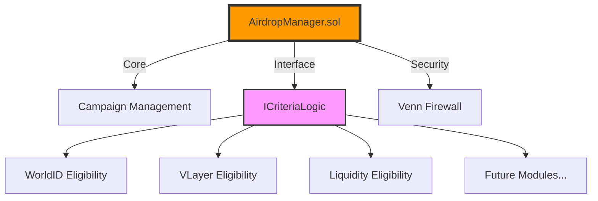

# 🌈 AirdropX: Modular Token Distribution Framework

## 🎯 Overview
AirdropX is a flexible and secure framework for creating customizable token distribution campaigns with pluggable eligibility criteria. Built with security and modularity in mind, it leverages the Venn Protocol for transaction firewall protection.

## 🏗️ Architecture


## 🔗 Deployed Contracts (Base Sepolia)

| Contract | Address | 
|----------|---------|
| AirdropManager | `0x3653Dcc8ACdfbCe9B156E5808C3eF383695ce720` |
| LiquidityBasedEligibility | `0xBd79093aed8F8762c1Cc34Ca7451242d1B9eAFF5` |
| TestProtocol | `0xa283f98380cf3a91836b408dbbaecf4d153a25ef` |
| VennFirewallConsumer | `0x38a88b37c9357b11a1b405825935a53ab4cbdaeb` |
| VennFirewall | `0x04f3B196E30e6F78174EF95a612E1f85A3B4110C` |
| USDC (Test Token) | `0x5dEaC602762362FE5f135FA5904351916053cF70` |
| WETH (Test Token) | `0x4200000000000000000000000000000000000006` |
| AverageBalance | `0x1824c0aee73934d0b4a64e6c634de729e9a99ec7` |
| VLayerEligibility | `0xe29a139da1eec4f7dc0c08b7d54d72aabbd62313` |

> Note: These contracts are deployed on Base Sepolia testnet (Chain ID: 84532)

## 🔥 Key Features

### 1. Modular Eligibility Criteria
- **WorldID Integration**: Sybil resistance through human verification
- **VLayer Support**: On-chain activity verification
- **Liquidity-Based**: Rewards for protocol participation
- **Extensible**: Easy to add new eligibility modules

### 2. Campaign Management
```solidity
// Example Campaign Creation
function createCampaign(
    address rewardToken,
    uint256 totalRewards,
    uint256 maxParticipants,
    uint256 startTime,
    uint256 endTime,
    address criteriaLogic
) external returns (uint256)
```

### 3. Security Features
- Venn Protocol integration for transaction firewall
- Time-locked campaigns
- Safe withdrawal mechanisms
- Duplicate claim prevention

## 🛠️ Technical Implementation

### Core Contracts
1. **AirdropManager.sol**: Entry point for campaign management

```9:71:src/AirdropManager.sol
contract AirdropManager is IAirdropManager, VennFirewallConsumer {
    uint256 private campaignCounter;
    mapping(uint256 => Campaign) private campaigns;
    mapping(uint256 => mapping(address => bool)) private hasClaimed;

    function createCampaign(
        address rewardToken,
        uint256 totalRewards,
        uint256 maxParticipants,
        uint256 startTime,
        uint256 endTime,
        address criteriaLogic
    ) external firewallProtected override returns (uint256) {
        require(endTime > startTime, "Invalid campaign duration");

        IERC20(rewardToken).transferFrom(msg.sender, address(this), totalRewards);

        campaignCounter++;
        campaigns[campaignCounter] = Campaign({
            creator: msg.sender,
            rewardToken: rewardToken,
            totalRewards: totalRewards,
            maxParticipants: maxParticipants,
            startTime: startTime,
            endTime: endTime,
            active: true,
            criteriaLogic: criteriaLogic
        });

        emit CampaignCreated(campaignCounter, msg.sender);
        return campaignCounter;
    }

    function claimReward(uint256 campaignId) external firewallProtected override {
        Campaign storage campaign = campaigns[campaignId];
        require(block.timestamp >= campaign.startTime, "Campaign not started");
        require(block.timestamp <= campaign.endTime, "Campaign ended");
        require(campaign.active, "Campaign inactive");
        require(!hasClaimed[campaignId][msg.sender], "Already claimed");

        ICriteriaLogic criteria = ICriteriaLogic(campaign.criteriaLogic);
        uint256 reward = criteria.calculateReward(msg.sender);

        hasClaimed[campaignId][msg.sender] = true;
        IERC20(campaign.rewardToken).transfer(msg.sender, reward);

        emit RewardClaimed(campaignId, msg.sender, reward);
    }

    function getCampaign(uint256 campaignId) external view override returns (Campaign memory) {
        return campaigns[campaignId];
    }

    function withdrawUnusedRewards(uint256 campaignId) external firewallProtected override {
        Campaign storage campaign = campaigns[campaignId];
        require(msg.sender == campaign.creator, "Not creator");
        require(block.timestamp > campaign.endTime, "Campaign still active");

        uint256 remainingRewards = IERC20(campaign.rewardToken).balanceOf(address(this));
        IERC20(campaign.rewardToken).transfer(campaign.creator, remainingRewards);
        campaign.active = false;
    }
}
```


2. **Eligibility Modules**:
- WorldID Eligibility
- VLayer Eligibility
- Liquidity-Based Eligibility

### Testing Framework
Comprehensive test suite covering:
- Campaign creation and management
- Eligibility verification
- Reward distribution
- Security measures


```54:77:test/AirdropManager.t.sol
    // Test claim reward
    function testClaimReward() public {
        // Simulate eligible user
        vm.startPrank(bob);
        
        uint256 balanceBefore = rewardToken.balanceOf(bob);
        // Add liquidity
        protocol.addLiquidity(100 ether, 100 ether);
        // Claim reward
        airdropManager.claimReward(campaignId);
        
        // Verify reward amount
        uint256 expectedReward = 100 ether; // 1000 ether / 100 participants
        assertEq(
            rewardToken.balanceOf(bob) - balanceBefore,
            expectedReward,
            "Incorrect reward amount"
        );
        
        // Try to claim again
        vm.expectRevert("Already claimed");
        airdropManager.claimReward(campaignId);
        vm.stopPrank();
    }
```


## 🚀 Getting Started

### Prerequisites
- Node.js v16+
- Foundry
- Base Sepolia RPC URL
- Venn Protocol API Key

### Installation
```bash
git clone https://github.com/yourusername/airdropx
cd airdropx
forge install
npm install
```

### Deployment
```bash
forge script script/Deploy.s.sol --rpc-url $RPC_URL --broadcast
```

## 📊 Use Cases

1. **Sybil-Resistant Airdrops**
   - Human verification through WorldID
   - One claim per verified human

2. **Activity-Based Rewards**
   - Reward users based on protocol interaction
   - VLayer proof verification

3. **Liquidity Mining Programs**
   - Incentivize protocol liquidity
   - Tiered rewards based on contribution

## 🔒 Security Considerations

- Venn Protocol firewall protection
- Time-locked withdrawals
- Eligibility verification
- Duplicate claim prevention
- Access control mechanisms

## 🤝 Contributing

We welcome contributions! See our [Contributing Guide](CONTRIBUTING.md) for details.

## 📄 License

MIT License - see [LICENSE](LICENSE) for details

## 🙏 Acknowledgments

- WorldID for identity verification
- Venn Protocol for security infrastructure
- Base for L2 infrastructure
- OpenZeppelin for contract standards

---

Built with 💜 by the AirdropX Team